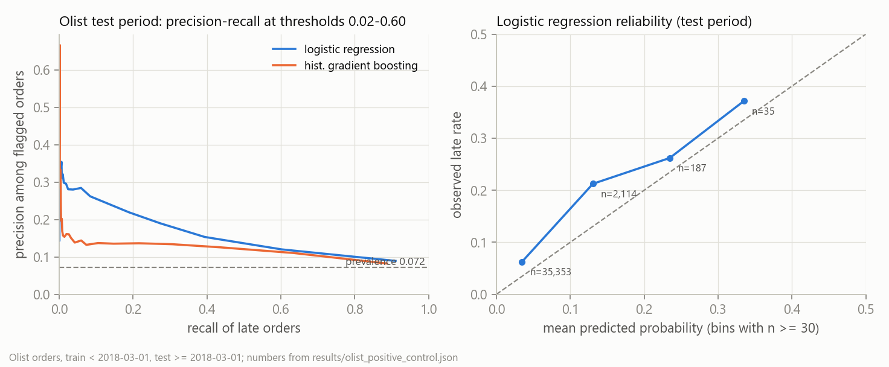

# Llama-3.2-1B-DelaySentinel: a label-leakage case study (not a delay predictor)

[](https://github.com/Yuchi-Wang02/delaysentinel/actions/workflows/test.yml)
[Code on GitHub](https://github.com/Yuchi-Wang02/delaysentinel) ·
[Model card on the Hub](https://huggingface.co/Yuchiwang02/Llama-3.2-1B-DelaySentinel) ·
[Frozen split](https://huggingface.co/datasets/Yuchiwang02/smart-logistics-delay-split-v0) ·
[Case study](docs/case_study.md) (中文: [docs/case_study.zh.md](docs/case_study.zh.md))

**In one screen**

- **Built (Sept 2025).** Full-parameter fine-tune of Llama-3.2-1B-Instruct on a 1,000-row Kaggle
  logistics table, shipped to the Hub without ever computing accuracy.
- **Found (Sept 2026).** Scored it for the first time: 100% on my own 200-row test split. The
  label is literally `Shipment_Status == "Delayed" OR Traffic_Status == "Heavy"` on all 1,000
  rows, and a two-split decision tree scores the same 1.000.
- **Shown.** 261 of 261 edits to those two fields flip the answer; 3,200 edits to the other 13
  fields change nothing. What decides the answer is the *surface form* of those two values, not the
  rule and not their meaning: it answers 1 for `Not Delayed`, for the truncation `Heav`, for
  `Delayed` written into an unrelated field, for `Delayed` in a free-text sentence, and also for
  `Early` and `Light`, while genuine synonyms like `Postponed` and `Congested` leave it at 0.
  Which forms fire is not explained by the rule, by meaning, or by a substring scan.
- **Changed.** Frozen split with hashes, baselines and intervals beside every number, 104 probe
  sets, a CI check that no document may quote an unsourced number, and licence compliance. The
  same discipline on real Olist orders gives AUROC 0.691, which is what an honest delay model
  looks like.

**Built with Llama.**

**Publication status.** The GitHub repository, the renamed Hub repository
`Yuchiwang02/Llama-3.2-1B-DelaySentinel` (the old name `Yuchiwang02/DelaySentinel` redirects) and the dataset mirror
are live; `scripts/publish_hf.py` uploads this card, the licence files, the results, the figures and the dataset
mirror from the repository, so the two copies of the card are the same file. The demo Space has not been created:
hosting a Gradio Space on the free CPU tier requires a paid Hugging Face plan, so its link below does not resolve;
the demo code is in `space/` and runs locally with `python space/app.py`.

**Reusable pieces.** `python -m delaysentinel.leakage_audit --csv <file> --target <col>` finds
pure single-column conditions and the greedy OR-rule in any table; `delaysentinel.probes` rewrites
prompts field by field for counterfactual, robustness and out-of-schema checks and records the
model's logit margin on each; `scripts/check_card_numbers.py` fails CI when any of eight documents
quotes a number that `results/*.json` or `runs/` does not contain.

- Numbers: [`results/eval.json`](results/eval.json) · per-row outputs: [`results/test_predictions.csv`](results/test_predictions.csv)
- Code, tests and figures: [github.com/Yuchi-Wang02/delaysentinel](https://github.com/Yuchi-Wang02/delaysentinel)
- Demo Space (not created yet; see Publication status): [Yuchiwang02/delaysentinel-leakage-demo](https://huggingface.co/spaces/Yuchiwang02/delaysentinel-leakage-demo)
- The story in prose: [`docs/case_study.md`](docs/case_study.md) · 中文: [`docs/case_study.zh.md`](docs/case_study.zh.md)

Terms used below. *SFT* = supervised fine-tuning; *bf16* = 16-bit brain-float weights; *greedy
decoding* = always take the most likely next token; *logit* = the model's raw score for a token
before softmax; *margin* = logit of the answer token `1` minus logit of `0`, read after the prefix
`Logistics_Delay:`; *teacher-forced* = scoring the model on fixed answer tokens instead of letting
it generate; *prevalence* = share of positives; *Wilson interval* = a binomial confidence interval
that stays valid at 100% accuracy; *bootstrap* = resampling rows (or months) to get an interval;
*AUROC* / *AUPRC* = area under the ROC / precision-recall curve; *Brier* = mean squared error of a
predicted probability; *reliability diagram* = observed rate against predicted probability, per
bin; *one-hot* = one 0/1 column per category value; *LoRA* = low-rank adapters instead of updating
all weights.

## The label is a rule over two of its own input columns

Verified on the full CSV (`results/eval.json` → `label_rule`):

| condition | rows | labelled delayed |
| --- | ---: | ---: |
| `Shipment_Status == "Delayed"` | 350 | 350 |
| `Traffic_Status == "Heavy"` | 327 | 327 |
| both | 111 | 111 |
| neither | 434 | 0 |

`Logistics_Delay = 1 iff Shipment_Status == "Delayed" OR Traffic_Status == "Heavy"` holds with 0
mismatches. `Shipment_Status == "Delayed"` is the target restated under another column name.
`Traffic_Status` is a road condition of the same timestamped snapshot: 118 of 118 rows that are
already *Delivered* but have *Heavy* traffic are labelled delayed, which no notion of an on-time
outcome would produce. Among the 434 rule-negative rows the positive rate is 0, so no other column
can add information. `python -m delaysentinel.leakage_audit` finds the rule automatically
(`results/leakage_audit.json`).


## Evaluation

**Split.** 200 test rows (116 positive / 84 negative, positive rate 0.58) from an **unseeded**
`random.shuffle` 80/20 split made once in September 2025 (train 800 rows, positive rate 0.5625).
0 test prompts occur in train. The split cannot be regenerated; the files are frozen with their
hashes in [`data/SPLIT.md`](data/SPLIT.md), checked by `tests/test_split_hashes.py`. The test file
was also passed to the Trainer as `eval_dataset` during training: the upstream trainer evaluates
a 10% subset every 200 steps and, because it wraps `SequentialSampler(Subset(...))`, that subset is
always the first 20 rows. Those 20 rows were used for eval loss (forward pass only: no gradient,
no metric, no hyper-parameter chosen on them); the other 180 were never touched. Treat the 200
rows as unblinded rather than as a clean test set.

**Decoding.** Greedy, `max_new_tokens` 8 (the answer is six tokens plus `<|eot_id|>`), the
Llama-3 chat template with its `Today Date` line pinned to `04 Sep 2025` (the template would
otherwise insert the current date; the pinned date and the sha256 of the rendered system turn are
in the JSON), the training system prompt, pad token `<|finetune_right_pad_id|>`, answers parsed
with an anchored regex and reported as unparsable on a non-match (never scored as 0). Run on
2026-09-06 on an RTX 5070 Ti against the weights downloaded from the Hub. `results/eval.json` →
`provenance` records the Hub LFS sha256 of `model.safetensors` (`ffc509c6…`), the git commit (with
a `-dirty` suffix when the working tree differs from it) and the library versions
(`scikit-learn` 1.7.2 matters for the boosting rows below). 200 rows in 3.11 s; the whole run,
104 probe sets included, takes 266.4 s.

| predictor (same 200 rows) | acc | 95% Wilson | precision | recall | F1 | confusion `[[TN,FP],[FN,TP]]` | AUROC |
| --- | ---: | --- | ---: | ---: | ---: | --- | ---: |
| **fine-tuned model, greedy** | 1.000 | [0.981, 1.000] | 1.000 | 1.000 | 1.000 | `[[84, 0], [0, 116]]` | saturated¹ |
| two-clause rule | 1.000 | [0.981, 1.000] | 1.000 | 1.000 | 1.000 | `[[84, 0], [0, 116]]` | n/a |
| decision tree, depth 2 | 1.000 | [0.981, 1.000] | 1.000 | 1.000 | 1.000 | `[[84, 0], [0, 116]]` | 1.000 |
| logistic regression | 1.000 | [0.981, 1.000] | 1.000 | 1.000 | 1.000 | `[[84, 0], [0, 116]]` | 1.000 |
| gradient boosting | 1.000 | [0.981, 1.000] | 1.000 | 1.000 | 1.000 | `[[84, 0], [0, 116]]` | 1.000 |
| all-positive | 0.580 | [0.511, 0.646] | 0.580 | 1.000 | 0.734 | `[[0, 84], [0, 116]]` | n/a |
| gradient boosting **without** the two rule columns² | 0.500 | [0.431, 0.569] | 0.556 | 0.690 | 0.615 | `[[20, 64], [36, 80]]` | 0.452 |
| … also without the post-hoc `Logistics_Delay_Reason` | 0.475 | [0.407, 0.544] | 0.539 | 0.655 | 0.591 | `[[19, 65], [40, 76]]` | 0.460 |
| … plus month / weekday / hour parsed from `Timestamp` | 0.520 | [0.451, 0.588] | 0.573 | 0.681 | 0.622 | `[[25, 59], [37, 79]]` | 0.482 |

¹ The model emits a hard label. Its teacher-forced margin on the 200 prompts runs from -20.7 to
+14.0, with median absolute value 13.5 and minimum absolute value 12.25, so the implied
probabilities are 0.000 or 1.000. The AUROC of 1.000 restates the hard labels: it adds nothing
beyond accuracy, and there is no calibrated probability or usable uncertainty behind it.
Bootstrap intervals are degenerate at zero errors and are not reported for the perfect rows; the
all-positive F1 interval is [0.680, 0.784] and the AUROC intervals of the three "without" rows
are [0.371, 0.528], [0.381, 0.541] and [0.400, 0.560].

² Feature encodings are recorded in `results/eval.json` → `baselines_split_v0.feature_encoding`.
Seeded repeated stratified 5-fold cross-validation over all 1,000 rows (3 repeats) gives the same
picture for every sklearn baseline: rule, tree, logistic and boosting 1.000 on every fold;
all-positive 0.566; the three "without" variants 0.496, 0.503 and 0.509 mean accuracy with mean
AUROC 0.463, 0.462 and 0.475. The fine-tuned model cannot be cross-validated because it has seen
the 800 training rows.

**Sampling check.** The repository originally shipped `generation_config.json` with the base
model's sampling defaults (`do_sample`, temperature 0.6, top-p 0.9). With that config and seeds
0, 1, 2 the test accuracy is 1.000 each time and 0 rows change between seeds. With margins of at
least 12.25 this follows from the greedy result and is not independent evidence; the config is now
greedy.

## What the model actually learned

All probes rewrite the text of the 200 frozen test prompts and re-score with greedy decoding;
each also records the teacher-forced margin. 104 probe sets in total (`results/eval.json` →
`probe_set_counts`).

**Edits to the two rule fields flip the answer; edits to every other field do not**

| edit | n | model prediction | margin (min abs.) |
| --- | ---: | --- | ---: |
| `Shipment_Status` Delayed → In Transit, on positives whose traffic is not Heavy | 50 | 50 flip to 0 | 17.6 |
| `Traffic_Status` Heavy → Clear, on positives whose status is not Delayed | 43 | 43 flip to 0 | 17.9 |
| `Traffic_Status` → Heavy, on all negatives | 84 | 84 flip to 1 | 12.25 |
| `Shipment_Status` → Delayed, on all negatives | 84 | 84 flip to 1 | 12.5 |
| each of the 13 non-rule fields set to a new value, 15 rewrites per row because `Logistics_Delay_Reason` takes three | 3,000 | 0 change | 12.1 |
| `Waiting_Time` and `Temperature` changed together, on negatives and on positives | 200 | 0 change | 12.5 |
| both rule lines deleted from every prompt | 200 | 200 predict 0 (accuracy vs gold 0.42) | 15.5 |

261 of 261 rule-field edits, over 177 distinct rows, flip as the rule predicts. (The 23 positives
that are both Delayed and Heavy cannot be flipped by a single edit and are not probed.) Of the
3,200 non-rule edits, 197 happen to leave the prompt unchanged because the row already carried
that value; none of the 3,200 changes a prediction.


**What is being matched: the strings, not the fields and not the meaning**

| rewrite | n | model prediction |
| --- | ---: | --- |
| rename `Shipment_Status` → `Status` and/or `Traffic_Status` → `Traffic` | 200 | unchanged: 1.000 vs gold |
| shuffle the order of the 15 lines (seeds 0, 1, 2) | 200 | unchanged: 1.000 vs gold |
| `Delayed` written as `DELAYED`, `delayed`, the bare stem `Delay`, or `Not Delayed` | 73 | all 73 predict 1 |
| `Delayed` written as `Late` or `Early` | 73 | all 73 predict 1 |
| `Delayed` written as `Behind schedule`, `Postponed`, `Overdue`, `Held up`, `On Time` or `Pending` | 73 | only the 23 rows whose traffic is Heavy predict 1 |
| `Heavy` written as `HEAVY`, `heavy`, the truncation `Heav`, `Not Heavy`, or `Light` | 66 | all 66 predict 1 |
| `Heavy` written as `Congested`, `Jammed`, `Gridlock`, `Slow`, `Dense`, `Free-flowing` or `Moderate` | 66 | only the 23 rows whose status is Delayed predict 1 |
| 12 unrelated single-token words (`Copper`, `Violet`, `Harbor`, …) in `Shipment_Status` | 73 each | all 12 give exactly the 23 baseline rows; none fires |
| the same 12 words in `Traffic_Status` | 66 each | 11 of 12 give the 23 baseline rows; `Meadow` fires on 10 extra rows (33 of 66) |
| `Heavy` or `Delayed` placed in `Logistics_Delay_Reason`, `Delayed` in `Asset_ID`, or the two values swapped between the rule fields, on negatives | 84 | all 84 predict 1 |
| an appended free-text line "Note: the depot supervisor is Mr. **Delayed**", on negatives | 84 | all 84 predict 1 |
| the same line with "Mr. **Heavy**", on negatives | 84 | 0 change (all stay 0) |
| delete only the `Shipment_Status` line | 200 | 66 predict 1: exactly the rows with traffic Heavy (1.000 agreement with the remaining clause) |
| delete only the `Traffic_Status` line | 200 | 73 predict 1: exactly the rows with status Delayed (1.000 agreement with the remaining clause) |
| `Shipment_Status` = Unknown and `Traffic_Status` = N/A on every row | 200 | 200 predict 0 |

**Prompts outside the training schema**

| prompt | model output | margin |
| --- | --- | ---: |
| the usage example from the September 2025 card (`order_id`, `carrier`, `weight_kg`, …) | `Logistics_Delay: 0` | -14.0 |
| the 15 column names with no values | `Logistics_Delay: 0` | -10.6 |
| an empty user turn | `Logistics_Delay: 0` | -2.1 |
| "What is the capital of France? Answer in one word." | `Paris` | -4.25 |

**Reading.** What decides the answer is the surface form of the value sitting in those two
fields, not the two-column rule and not the meaning of the words. Case does not matter, truncation does
not matter (`Heav` fires), negation does not matter (`Not Delayed` fires), the column does not
matter (`Delayed` in `Asset_ID` fires), and column names and line order do not matter. Meaning
mostly does not fire either: four of the five synonyms for delayed and all five for heavy traffic
leave the answer at the baseline, while the fifth synonym, `Late`, fires, as do the antonyms
`Early` and `Light`. Twelve unrelated words in the same slots almost never
fire, so this is a specific match and not a general "any unseen value" effect; the one exception,
`Meadow` in `Traffic_Status` on 10 of 66 rows, is the only spurious trigger among them.
The two clauses are not implemented alike: the delayed trigger fires from anywhere in the turn,
including an appended free-text sentence, while the heavy-traffic trigger only fires from a
`Column: value` field. What is *not* established is the pattern itself, and two probes rule out
the obvious guess. It is **not** a match on the strings `Delay` and `Heavy`: `Late`, `Early` and
`Light` contain neither and fire on every row. It is not a substring scan of the prompt either:
the field name `Logistics_Delay_Reason` carries "Delay" in all 200 prompts and never fires. So the
set of forms that fire — the two training values with their case variants, the truncation `Heav`,
the negations, plus `Late`, `Early` and `Light`, but not `Postponed`, `Overdue`, `Congested` or
`Gridlock` — has no explanation in this repository. None of this is delay prediction: the model is
answering from the form of the text rather than from what the text says. The training loss reads
0.0000 from step 50, the end of the first epoch, so the training labels were fitted by then;
whether the weights already used this shortcut at that point cannot be probed, because no
checkpoint before step 1,300 survives. Every probe above describes the final weights.

## Reference study on real order data

To show what these metrics look like where there is something to learn, `python -m
delaysentinel.positive_control` runs classical baselines on the public Olist Brazilian e-commerce
orders (99,441 real, anonymised orders, 2016-2018; Kaggle licence CC BY-NC-SA 4.0, used
non-commercially with attribution; no Olist row is committed here). Label: `late =
delivered_customer_date > estimated_delivery_date` on delivered orders. Features are restricted to
what is known at checkout. Numbers in
[`results/olist_positive_control.json`](results/olist_positive_control.json).

Three filters run before the model sees anything, and the JSON reports each. The 60-day
right-censoring guard keeps only orders purchased on or before 2018-08-18, taking 99,441 orders
down to 97,938. Of those, 2,919 were still undelivered when the data was extracted, every one of
them already past its promised date: 1,723 in flight, 1,188 cancelled or unavailable, and 8 marked
`delivered` with no delivery timestamp. The delivered-only filter removes all 2,919 instead of
labelling them late, which is a survivorship filter, not a censoring correction; the sensitivity
row below adds back the 555 of them that fall in the test window. That leaves 95,019 orders to
model. Separately, a model
deployed on 2018-03-01 can only train on labels that exist by then, so the training set is orders
*delivered* before that date (53,644 orders, late rate 0.0505) and the test set is orders
*purchased* on or after it (37,702 orders, late rate 0.0722); 3,673 orders purchased before the
split but delivered after it, 1,075 of them late, belong to neither.

| model (test period) | AUROC [orders] | AUROC [months] | AUPRC | Brier | mean predicted |
| --- | --- | --- | --- | ---: | ---: |
| constant = training late rate | 0.500 | n/a | 0.0722 (= prevalence) | 0.0675 | 0.0505 |
| promised lead time only (shorter = riskier) | 0.5568 | n/a | 0.0953 | n/a | n/a |
| logistic regression | 0.6908 [0.6819, 0.6993] | [0.6329, 0.7599] | 0.155 [0.1445, 0.1669] | 0.0657 | 0.0413 |
| … without `purchase_month` | 0.6829 [0.6729, 0.6922] | [0.6355, 0.7472] | 0.139 [0.1305, 0.149] | 0.0654 | 0.0558 |
| histogram gradient boosting | 0.6507 [0.6397, 0.6608] | [0.607, 0.7502] | 0.1176 [0.111, 0.1248] | 0.0668 | 0.0504 |
| logistic regression, in-flight orders counted late | 0.6812 [0.6718, 0.6896] | [0.626, 0.7437] | 0.1742 [0.165, 0.1844] | 0.0777 | 0.0415 (prevalence 0.0857) |

The order-level bootstrap interval is within-period resampling; resampling whole months instead
gives six to seven times the width, which is the honest uncertainty for "would this hold next
period". The reason is visible in the by-month table: the late rate in the test window swings from
0.0116 in June 2018 to 0.1896 in March 2018, and the model predicts 0.0493 for that March. That is
not a prevalence drift the model could have known about, and it is not fixed by dropping
`purchase_month` (that variant predicts 0.0565 for the same month). The score is therefore
mis-calibrated across the split: mean predicted 0.0413 against an observed 0.0722. No
re-calibration was attempted; a deployed model would need a recent validation period first.

For the decision "expedite if flagged", with an expedite cost paid on every flagged order and a
late-delivery cost avoided with efficacy *e*, the optimal threshold on a *calibrated* probability
is `p* = C_expedite / (e · C_late)`. The sweep in the JSON is therefore reported as score
thresholds, not cost ratios: at a score of 0.1 the logistic model flags 6.2% of orders and catches
18.9% of late ones, and 21.9% of the flagged orders really are late.

Finally, the same leakage scanner that finds the DelaySentinel rule in a second finds **no**
pure-positive condition here: the greedy OR-rule is empty, and a depth-2 tree reaches 0.9278,
which is just the majority class. (Three pure-negative conditions appear, each covering 20 to 26
rows, which is small-sample noise.) That is the negative control for the scanner.



## Feature credibility audit

Every row of the Kaggle table is a timestamped snapshot, so no field has lead time relative to
the label. The "decision time" column says what the same field would mean in an order-level delay
model (the author's domain judgment; the dataset documents no semantics).

| field(s) | relation to the label | in an order-level model, known at |
| --- | --- | --- |
| `Shipment_Status` | definitional: `Delayed` ⇒ 1 (350 of 350); the label is a function of this field | delivery (it is the outcome) |
| `Traffic_Status` | contemporaneous road state: `Heavy` ⇒ 1 (327 of 327), even on 118 already-delivered rows | carrier handoff or later |
| `Logistics_Delay_Reason` | present on 419 delayed and 318 non-delayed rows; no signal (the "without reason" baseline row above) | delivery (post-hoc) |
| `Waiting_Time`, `Temperature`, `Humidity`, `Inventory_Level`, `Asset_Utilization`, `Demand_Forecast`, `User_Transaction_Amount`, `User_Purchase_Frequency` | no learnable signal (AUROC 0.452 without the rule columns) | undocumented |
| `Timestamp` | month / weekday / hour add nothing (AUROC 0.482) | checkout |
| `Asset_ID`, `Latitude`, `Longitude` | synthetic; coordinates uniform over the globe | n/a |

None of the inputs a logistics practitioner would expect for delay risk (lane, carrier, service
level, promised versus actual dates, weight/cube, carrier × lane history) exists in this table.

## Training data

- Source: Kaggle "Smart Logistics Supply Chain Dataset" by ziya07, listed as CC0 Public Domain
  when read on 2026-09-03,
  <https://www.kaggle.com/datasets/ziya07/smart-logistics-supply-chain-dataset>. One CSV (105,482
  bytes as committed; the Kaggle page shows 106 KB), 1,000 rows × 16 columns (15 inputs +
  `Logistics_Delay`); 566 delayed / 434 not delayed. Mirrored with the frozen split as
  [`Yuchiwang02/smart-logistics-delay-split-v0`](https://huggingface.co/datasets/Yuchiwang02/smart-logistics-delay-split-v0)
  (created by the publish script).
- Categorical values: `Shipment_Status` Delayed 350 / Delivered 338 / In Transit 312;
  `Traffic_Status` Detour 345 / Clear 328 / Heavy 327; `Logistics_Delay_Reason` Weather 267 /
  None 263 / Traffic 236 / Mechanical Failure 234.
- Despite the Kaggle page's "real-time" wording, the content is synthetic. Latitude and longitude
  are uniform over the whole globe, which the figure below shows; the other numeric columns look
  uniform between round bounds and the timestamps evenly spread over 2024 by eye, but no test of
  uniformity is committed. There are 10 `Asset_ID` trucks, and a delay *reason* is present on 318
  rows that are not delayed. The 263 missing reasons are the literal string `None` in the CSV and
  reach the prompt unchanged.
- Granularity: each row is a per-truck snapshot (inventory level, temperature, humidity and a
  customer's purchase frequency on the same row), not an order. There is no promised-versus-actual
  delivery date, so "delay" is a status flag, not an on-time measure.
- Serialisation (`legacy/Transform.py`, author's code): the system prompt, the 15 non-target
  columns as `Column: value` lines in CSV order, and `Logistics_Delay: 0|1` as the answer.
- Split (`legacy/shuffle.py`, author's code): `random.shuffle` without a seed, first 800 train,
  last 200 test. `tests/test_transform.py` checks that the frozen files are exactly a permutation
  of the CSV.


## Training procedure

Recovered from `training_args.bin` (run `sc904`, whose `model.safetensors` hash equals the Hub
LFS hash; [`runs/RUNS.md`](runs/RUNS.md)):

- Full-parameter SFT of all 1,235,814,400 parameters (no LoRA), assistant-only loss masking, bf16,
  gradient checkpointing, `group_by_length`, seed 42, `adamw_torch_fused`.
- 30 epochs = 1,500 steps; per-device batch 4 × gradient accumulation 4 = effective batch 16
  (50 steps per epoch); learning rate 2e-5, cosine schedule, no warmup, weight decay 0.1; eval
  every 200 steps on the 20-row subset described above; checkpoint every 100 steps; logging
  every 5 steps.
- The logged training loss (5-step mean, rounded to 4 decimals) reads 0.0000 from the step-50 log
  point, the end of the first epoch; the gradient norm is still 0.0006 at step 1,500, so the true
  loss is small, not zero. Eval loss on the 20-row subset goes 5.23 → 3.00 → 3.05 (×1e-6) at steps
  200, 1000 and 1400. Two further runs (65 and 100 epochs) reach the same logged 0.0000 by log
  points 70 and 45.
- Wall-clock: about 1,090 s (18 min) between the creation of the first and the last TensorBoard
  event file of the published run (`runs/sc904/tensorboard_events.json`), which excludes model
  loading; the GPU model was not logged.
- Scheduler quirk inherited from the upstream script: `learning_rate_overshoot = 1.15` plans the
  cosine schedule for 1,725 steps and training stops at 1,500, so the learning rate never reaches
  zero (8.3e-07 at the last step).
- Training script: `scripts/train.py`, a third-party file kept byte-for-byte; see *Attribution*.


## How to use

The model was trained only on the 15-column schema below; its output on any other input is
meaningless (see the probes). Decode greedily, pin the template date, and parse with an anchored
regex; treat a non-match as unparsable, never as 0.

```python
import re
import torch
from transformers import AutoModelForCausalLM, AutoTokenizer

REPO = "Yuchiwang02/Llama-3.2-1B-DelaySentinel"  # "Yuchiwang02/DelaySentinel" until the rename lands
tok = AutoTokenizer.from_pretrained(REPO)
model = AutoModelForCausalLM.from_pretrained(REPO, torch_dtype=torch.bfloat16, device_map="auto")

SYSTEM = ("Assume you are a supply chain analyst. Based on the following information, "
          "output the result for Logistics_Delay, where 1 represents a delay and 0 represents no delay.")
# First row of data/test.jsonl (gold label 0). Same 15 columns, same order, as in training.
USER = """Timestamp: 2024-07-18 12:19:20
Asset_ID: Truck_10
Latitude: 20.2969
Longitude: 124.1885
Inventory_Level: 298
Shipment_Status: In Transit
Temperature: 18.6
Humidity: 74.4
Traffic_Status: Detour
Waiting_Time: 41
User_Transaction_Amount: 248
User_Purchase_Frequency: 1
Logistics_Delay_Reason: None
Asset_Utilization: 86.3
Demand_Forecast: 283"""

messages = [{"role": "system", "content": SYSTEM}, {"role": "user", "content": USER}]
input_ids = tok.apply_chat_template(
    messages, add_generation_prompt=True, return_tensors="pt", date_string="04 Sep 2025"
).to(model.device)
out = model.generate(
    input_ids,
    do_sample=False,
    max_new_tokens=8,
    pad_token_id=tok.convert_tokens_to_ids("<|finetune_right_pad_id|>"),  # never add a pad token / resize embeddings
)
text = tok.decode(out[0, input_ids.shape[1]:], skip_special_tokens=True).strip()
m = re.match(r"^\s*Logistics_Delay:\s*([01])\b", text)
label = int(m.group(1)) if m else None  # None = unparsable
print(text, label)                      # -> Logistics_Delay: 0  0
```

Or, with the package: `from delaysentinel.model import Scorer` and `Scorer(REPO).predict([USER])`.

## Reproduce

Run from the repository root:

```bash
git clone https://github.com/Yuchi-Wang02/delaysentinel && cd delaysentinel
pip install -r requirements-lock.txt && pip install -e .
python -m pytest -q
python -m delaysentinel.eval --model Yuchiwang02/Llama-3.2-1B-DelaySentinel --out results/eval.json
python -m delaysentinel.positive_control --out results/olist_positive_control.json
python -m delaysentinel.eda --out docs/figures
python -m delaysentinel.leakage_audit --csv data/smart_logistics_dataset.csv --target Logistics_Delay
python scripts/check_card_numbers.py
```

The test suite needs no model download. `--skip-model` runs the rule and the sklearn baselines
only, which is what CI does. CI asserts that the rule, the depth-2 tree, logistic regression and
all-positive reproduce exactly under the pinned `scikit-learn`, and that the three gradient-boosting
variants agree with the committed numbers to within one of the 200 test rows: gradient boosting is
not bit-identical across operating systems, and the committed numbers were produced on Windows.

## Intended use and out-of-scope use

- Intended: a teaching example of target leakage, trivial-baseline comparison and counterfactual
  probing on a text-serialised tabular task; a reference checkpoint for reproducing the numbers
  above.
- Out of scope: any operational delay forecasting, risk scoring or decision support; any input
  schema other than the 15 columns above; any claim that an LLM is competitive with tree models on
  tabular data (every baseline ties at 1.000 here, so the comparison is uninformative).

## Limitations and known issues

- The label is a deterministic two-field rule; every metric above measures that rule, not
  generalisation.
- The test split is 200 rows from an unseeded shuffle, its first 20 rows served as the Trainer
  eval subset during training, and it cannot be regenerated. There is no separate validation set.
- The data are synthetic and physically implausible; the row grain is a truck snapshot, not an
  order; no promised-versus-actual dates exist.
- Output is a hard label: no calibrated probability, no cost-sensitive threshold. AUROC, Brier
  score and reliability diagrams are not meaningful for this checkpoint.
- No abstention: the model answers `0` on an empty prompt, a header-only prompt and a foreign
  schema.
- The learned detector keys on the surface form of the value, blind to negation and to which
  field the value sits in. Which forms it accepts is not established: `Early` and `Light` fire
  while `Postponed` and `Congested` do not.
- Training/inference mismatch inherited from the upstream collator: with no pad token defined,
  the tokenizer's eos token (`<|eot_id|>`) was used as the pad value and
  `attention_mask = input_ids != eos`, so the genuine `<|eot_id|>` closing the system and user
  turns was masked during training. The assistant-side `<|eot_id|>` stayed in the loss, so the
  model still stops. Effect on this task: none observed; on harder tasks: untested. Disclosed,
  not retrained.
- The September 2025 release shipped with `do_sample: true` (base-model defaults) and
  `use_cache: false` (set unconditionally by the training script); both are corrected in the
  config files by the publish script without touching the weights.
- 30 full-parameter epochs to fit a rule that a two-split tree fits with a millisecond of CPU; no
  early stopping, no LoRA, no sample-efficiency curve; no checkpoint before step 1,300 survives.
- Teacher-forced margins are bf16 values at batch size 16 and can differ in the last digits under
  a different batch composition.
- `scripts/check_card_numbers.py` is a presence check with a reasoned allowlist: it catches
  invented, stale and mistyped numbers, but it cannot tell whether a number sits next to the right
  label. The tables were checked by hand against the JSON keys named in each section.

## What would make this non-trivial

- *Partly implemented* (reference study above): a dataset with promised-versus-actual delivery
  dates, a label defined as `delivered > promised`, checkout-time features only, a
  label-availability split, classical baselines with AUPRC and both order-level and month-block
  intervals, and the leakage scanner as a negative control.
- Not implemented: a validation period, separate from the test period, for threshold and
  calibration choice; monotone re-calibration on recent data; LoRA fine-tuning of an LLM on the
  Olist task with label-token logit scoring, so that an LLM-versus-tree comparison exists where
  the label is not a rule; a probe suite designed *before* training rather than a year after.

## Repository layout

| path | content |
| --- | --- |
| `src/delaysentinel/` | prompt format, frozen-split loader and hashes, metrics with intervals, eight baselines, 104 probe sets with margins, model wrapper, figures, leakage scanner, Olist reference study |
| `results/` | `eval.json` (all DelaySentinel numbers), `test_predictions.csv` (per-row outputs and margins), `leakage_audit.json`, `olist_positive_control.json` |
| `data/` | the CSV, the frozen `train.jsonl` / `test.jsonl`, `SPLIT.md` with hashes, `DATASET_CARD.md` |
| `runs/` | `RUNS.md`; per run `training_config.json` + `trainer_state.json`; `sc904/tensorboard_events.json` |
| `docs/` | `case_study.md` (English), `case_study.zh.md` (中文), `leakage_audit.md`, `figures/` |
| `scripts/` | third-party `train.py`, `train_sft.sh` (reconstructed command), `check_card_numbers.py`, `publish_hf.py` |
| `space/` | the Gradio demo |
| `legacy/` | the September 2025 pipeline exactly as it was run (unmaintained) |
| `tests/` | pytest, no model download; includes the licence-file and number-check self-tests |

## Attribution and license

- **Base model.** `meta-llama/Llama-3.2-1B-Instruct`, Llama 3.2 Community License. The training
  command line was not logged (`scripts/train_sft.sh` is a reconstruction); the evidence that the
  Instruct checkpoint was used is that the published `config.json` carries the Instruct
  `eos_token_id` list and the repo ships the Instruct `chat_template.jinja`, neither of which the
  base `Llama-3.2-1B` has. The September 2025 card's front-matter `base_model:
  meta-llama/Llama-3.2-1B` was a metadata error. This repository ships `LICENSE` (the agreement),
  `USE_POLICY.md` and `NOTICE` with the required attribution line "Llama 3.2 is licensed under the
  Llama 3.2 Community License, Copyright © Meta Platforms, Inc. All Rights Reserved." Use of the
  weights is subject to that licence and the Acceptable Use Policy.
- **Model name.** Section 1.b.i of that licence requires a derivative's name to begin with
  "Llama", hence `Llama-3.2-1B-DelaySentinel`; the model was first published as
  `Yuchiwang02/DelaySentinel` and the publish script moves it (the Hub keeps a redirect).
- **Training script.** `scripts/train.py` is **not my work**: it is `train.py` from
  [acon96/home-llm](https://github.com/acon96/home-llm) (MIT, Copyright 2024 Alex O'Connell;
  upstream also records code reused from Stanford Alpaca under Apache-2.0, full text in
  `LICENSES/Apache-2.0.txt`), kept byte-for-byte apart from a header comment. The last upstream
  commit touching it before this project's training run was `136d2bf` (2025-02-26); it differs
  from that revision in exactly three places, listed in `THIRD_PARTY_LICENSES.md`.
- **Author's own code.** Everything under `src/`, `tests/`, `scripts/` (except `train.py`),
  `space/`, `legacy/` (including the September 2025 Flask UI and transforms), `docs/`, `results/`
  and `runs/`: MIT, see `LICENSE-MIT`. `results/olist_positive_control.json` is a derivative of a
  ShareAlike dataset and is offered under CC BY-NC-SA 4.0 instead.
- **Data.** Kaggle ziya07, listed as CC0. Reference study: Brazilian E-Commerce Public Dataset by
  Olist, CC BY-NC-SA 4.0, downloaded at run time and cached locally, never committed. Details in
  `THIRD_PARTY_LICENSES.md`.
- **Audit.** The leakage audit, baselines and probes were added in September 2026, a year after
  training. The exploratory analysis that exposes the rule should have preceded training.

## Citation

```bibtex
@misc{wang2026delaysentinel,
  title  = {Llama-3.2-1B-DelaySentinel: a label-leakage case study on a synthetic logistics table},
  author = {Wang, Yuchi},
  year   = {2026},
  note   = {Weights trained September 2025 (full-parameter SFT of meta-llama/Llama-3.2-1B-Instruct); audit, baselines, probes and reference study added September 2026},
  url    = {https://huggingface.co/Yuchiwang02/Llama-3.2-1B-DelaySentinel}
}
```

## Related

Successor project: [BizHallu](https://github.com/Yuchi-Wang02/bizhallu), a span-level grounding
audit of LLM-generated business analysis against transaction evidence. DelaySentinel is the
earlier work whose perfect score turned out to be uninformative; BizHallu reports every detector
metric next to trivial baselines and bootstrap intervals for that reason.

## 中文摘要

这是一个 label-leakage 案例，不是延误预测模型。2025 年 9 月我在 1,000 行 Kaggle 合成物流表上对
Llama-3.2-1B-Instruct 做了全参数 SFT，只看了训练 loss 就发布了；2026 年 9 月我第一次真正评估它，在自己的
200 行测试集上 accuracy 1.000。问题正是这个数字：标签就是规则 `Shipment_Status == "Delayed" OR
Traffic_Status == "Heavy"`（1,000 行零例外），两次分裂的决策树同样 1.000。探针显示模型学到的是对
两个规则字段里那个值的表层写法：大小写无关、截断成 `Heav` 也触发、写成 `Not Delayed` 照样触发、放进
任何字段甚至一句自由文本都触发，而 `Postponed`、`Congested` 这样真正的同义词不触发。本仓库把当年的
pipeline 整理成可复现的代码、冻结的切分、带区间的指标、104 组探针、合规的许可证文件，并在真实的 Olist
订单数据上用同一套方法做了参照研究（logistic regression AUROC 0.6908，prevalence 0.0722）。每个数字都来自
`results/*.json`。详细经过见 `docs/case_study.zh.md`。
