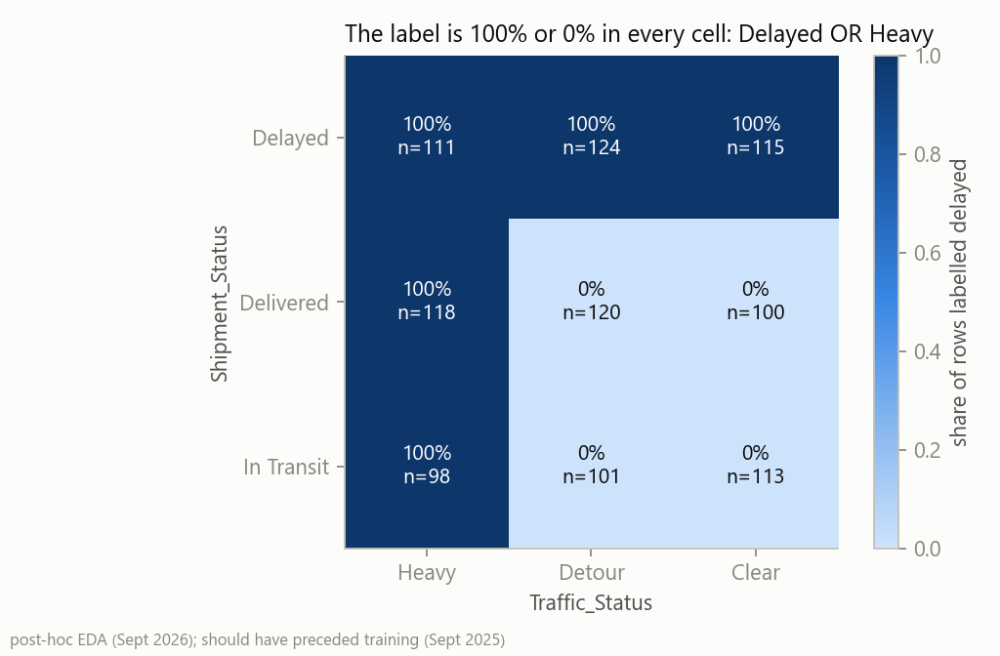
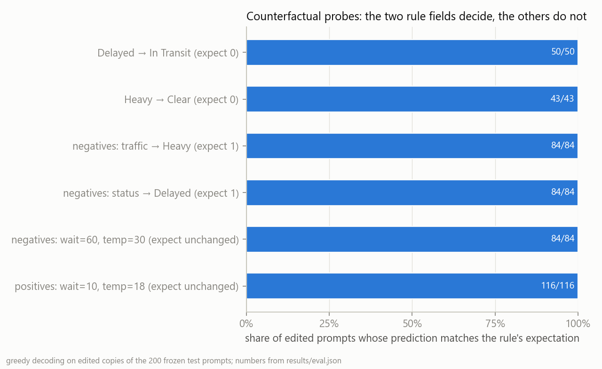
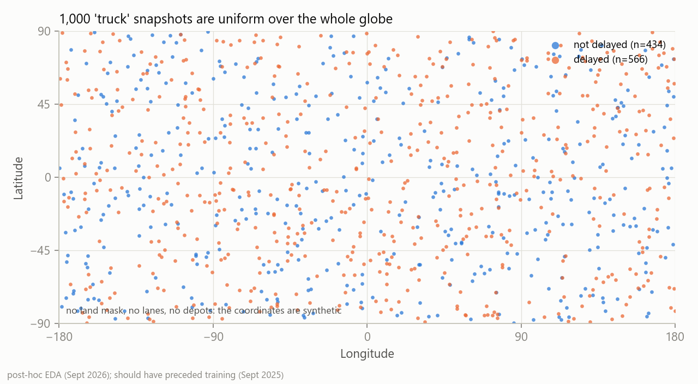
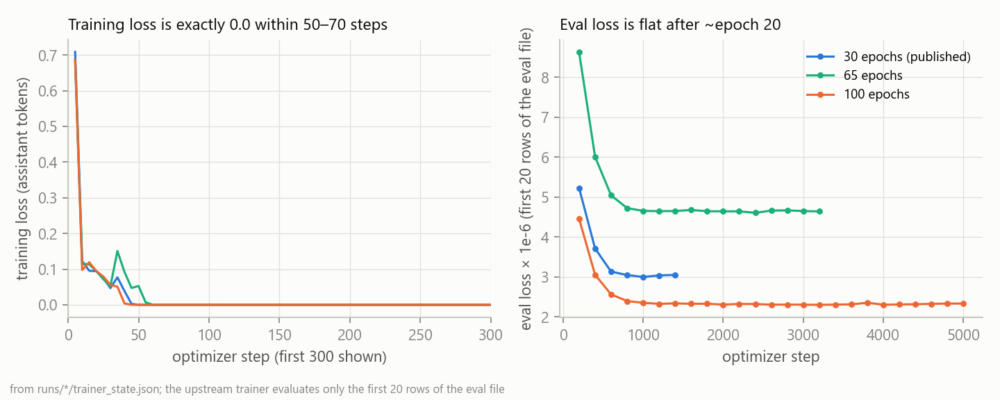

# Llama-3.2-1B-DelaySentinel: a label-leakage case study (not a delay predictor)

**Built with Llama.**

> **What this is.** A full-parameter fine-tune of `meta-llama/Llama-3.2-1B-Instruct` that answers
> `Logistics_Delay: 0` or `Logistics_Delay: 1` from 15 fields of a synthetic Kaggle logistics table.
> It scores accuracy 1.000 on its own 200-row test split. **That number is uninformative:** the label
> *is* the rule `Shipment_Status == "Delayed" OR Traffic_Status == "Heavy"` (1,000 of 1,000 rows), a
> depth-2 decision tree scores the same, and counterfactual probes show the 1.24B-parameter model
> behaves as that rule. Keep it as a worked example of target leakage and of what to check before
> trusting a perfect score. Do not use it to predict shipment delays.

**Model name.** The Llama 3.2 Community License (section 1.b.i) requires a derivative's name to begin
with "Llama". This model was first published in September 2025 as `Yuchiwang02/DelaySentinel`; the
repository is being renamed to `Yuchiwang02/Llama-3.2-1B-DelaySentinel` (the old URL redirects).

Every metric on this page is produced by `python -m delaysentinel.eval` and stored in
[`results/eval.json`](results/eval.json); training-run numbers come from `runs/`. CI
(`scripts/check_card_numbers.py`) rejects any README number that appears in none of `results/*.json`,
`runs/`, or the 45-entry `scripts/card_number_allowlist.txt`. It checks presence, not that a number
sits next to the right label; the tables were checked by hand against the JSON keys named in each
section. Code, tests and figures:
[github.com/Yuchi-Wang02/delaysentinel](https://github.com/Yuchi-Wang02/delaysentinel).
Interactive demo: [Yuchiwang02/delaysentinel-leakage-demo](https://huggingface.co/spaces/Yuchiwang02/delaysentinel-leakage-demo).

## TL;DR

- **Task as trained.** 1,000 rows × 15 input columns serialised as `Column: value` lines; the assistant
  answers `Logistics_Delay: 0|1`. Full-parameter SFT, bf16, 30 epochs, 1,500 steps.
- **Score.** Greedy decoding on the frozen 200-row test split: accuracy 1.000, F1 1.000, confusion
  `[[84, 0], [0, 116]]`, 0 unparsable outputs. Wilson 95% interval [0.981, 1.000].
- **Why the score is empty.** The two-clause rule reproduces all 1,000 labels. On the same 200 rows the
  rule, a depth-2 decision tree, logistic regression and gradient boosting all score 1.000; all-positive
  scores 0.580. Gradient boosting *without* the two rule columns scores 0.500 (AUROC 0.452): nothing
  else in the table carries signal.
- **What the model learned.** Editing the rule fields flips 177 of 177 predictions in the expected
  direction; editing non-rule fields changes 0 of 200. The model is invariant to column renaming and
  column order, treats `Late`/`DELAYED`/`delayed` like `Delayed`, does **not** treat `Congested` like
  `Heavy`, evaluates each clause on its own when the other field is deleted, and emits a confident
  `Logistics_Delay: 0` on an empty prompt, a header-only prompt and a schema it never saw.

## Label leakage disclosure

Verified on the full CSV (`results/eval.json` → `label_rule`):

| condition | rows | labelled delayed |
| --- | ---: | ---: |
| `Shipment_Status == "Delayed"` | 350 | 350 |
| `Traffic_Status == "Heavy"` | 327 | 327 |
| neither | 434 | 0 |

`Logistics_Delay = 1 iff Shipment_Status == "Delayed" OR Traffic_Status == "Heavy"` holds with 0
mismatches. `Shipment_Status == "Delayed"` is the target restated under another column name;
`Traffic_Status` is a road condition observable only while the shipment is in transit. Both columns were
written verbatim into every training prompt. Among the 434 rule-negative rows the positive rate is 0,
so no other column can add information. `python -m delaysentinel.leakage_audit` finds the rule
automatically (`results/leakage_audit.json`).



## Evaluation

**Split.** 200 test rows (116 positive / 84 negative, positive rate 0.58) from an **unseeded**
`random.shuffle` 80/20 split made once in September 2025 (train 800 rows, positive rate 0.5625).
0 test prompts occur in train. The split cannot be regenerated; the two JSONL files are frozen with
their hashes in [`data/SPLIT.md`](data/SPLIT.md). The test file was also passed to the Trainer as
`eval_dataset` during training: the upstream trainer evaluates a 10% subset every 200 steps and,
because it wraps `SequentialSampler(Subset(...))`, that subset is always the first 20 rows of the
file. The test set was therefore *seen* during training (no accuracy was computed at the time and no
hyper-parameter was selected on it). It is not a held-out set.

**Decoding.** Greedy, `max_new_tokens` 8, Llama-3 chat template, the training system prompt; pad token
`<|finetune_right_pad_id|>`; answers parsed with an anchored regex and counted as unparsable on a
non-match (never mapped to 0). Run on 2026-09-05 on an RTX 5070 Ti against weights whose sha256
(`ffc509c6…`) equals the LFS hash of `model.safetensors` in this repository; 200 rows in 3.16 s.

| predictor (same 200 rows) | acc | 95% Wilson | precision | recall | F1 | confusion `[[TN,FP],[FN,TP]]` | AUROC |
| --- | ---: | --- | ---: | ---: | ---: | --- | ---: |
| **fine-tuned model, greedy** | 1.000 | [0.981, 1.000] | 1.000 | 1.000 | 1.000 | `[[84, 0], [0, 116]]` | saturated¹ |
| two-clause rule | 1.000 | [0.981, 1.000] | 1.000 | 1.000 | 1.000 | `[[84, 0], [0, 116]]` | n/a |
| decision tree, depth 2 | 1.000 | [0.981, 1.000] | 1.000 | 1.000 | 1.000 | `[[84, 0], [0, 116]]` | 1.000 |
| logistic regression | 1.000 | [0.981, 1.000] | 1.000 | 1.000 | 1.000 | `[[84, 0], [0, 116]]` | 1.000 |
| gradient boosting | 1.000 | [0.981, 1.000] | 1.000 | 1.000 | 1.000 | `[[84, 0], [0, 116]]` | 1.000 |
| all-positive | 0.580 | [0.511, 0.646] | 0.580 | 1.000 | 0.734 | `[[0, 84], [0, 116]]` | n/a |
| gradient boosting **without** the two rule columns | 0.500 | [0.431, 0.569] | 0.556 | 0.690 | 0.615 | `[[20, 64], [36, 80]]` | 0.452 |

¹ The model emits a hard label. A teacher-forced score (logit of `1` minus logit of `0` after the
prefix `Logistics_Delay:`) exists for diagnostics only: margins run from -20.6 to +13.9 with median
absolute value 13.4, so the implied probabilities are 0.000 or 1.000 and the AUROC of 1.000 carries no
ranking information. Bootstrap intervals are degenerate at zero errors and are not reported for the
perfect rows; the all-positive F1 interval is [0.680, 0.784] and the without-rule-columns AUROC
interval is [0.371, 0.528].

**Baseline robustness (sklearn only).** Seeded repeated stratified 5-fold CV over all 1,000 rows
(3 repeats): rule, tree, logistic and boosting 1.000 on every fold; all-positive 0.566; boosting
without the rule columns 0.496 mean accuracy, mean AUROC 0.463. The fine-tuned model cannot be
cross-validated because it has seen the 800 training rows.

**Sampling check.** The repository originally shipped `generation_config.json` with the base model's
sampling defaults (`do_sample`, temperature 0.6, top-p 0.9). With that config and seeds 0, 1, 2 the
test accuracy is 1.000 each time and 0 rows change between seeds. It was still wrong in principle for a
classifier; the config is now greedy.

## What the model actually learned

All probes rewrite the text of the 200 frozen test prompts and re-score with greedy decoding
(`results/eval.json` → `counterfactual_probe`, `robustness_probe`, `ood_probe`).

**Counterfactual edits to the rule fields and to non-rule fields**

| edit | n | model prediction |
| --- | ---: | --- |
| `Shipment_Status` Delayed → In Transit, on positives whose traffic is not Heavy | 50 | 50 flip to 0 |
| `Traffic_Status` Heavy → Clear, on positives whose status is not Delayed | 43 | 43 flip to 0 |
| `Traffic_Status` → Heavy, on all negatives | 84 | 84 flip to 1 |
| `Shipment_Status` → Delayed, on all negatives | 84 | 84 flip to 1 |
| `Waiting_Time` = 60 and `Temperature` = 30.0, on all negatives | 84 | 0 change |
| `Waiting_Time` = 10 and `Temperature` = 18.0, on all positives | 116 | 0 change |
| both rule lines deleted from every prompt | 200 | 200 predict 0 (accuracy vs gold 0.42) |



**Robustness of the learned rule**

| rewrite | n | model prediction |
| --- | ---: | --- |
| rename `Shipment_Status` → `Status` and `Traffic_Status` → `Traffic` | 200 | unchanged: 1.000 vs gold |
| rename only one of the two columns | 200 | unchanged: 1.000 vs gold |
| shuffle the order of the 15 lines (seeds 0, 1, 2) | 200 | unchanged: 1.000 vs gold |
| write `Delayed` as `Late`, `DELAYED` or `delayed` (rows with status Delayed) | 73 | 73 still predict 1 |
| write `Heavy` as `HEAVY` or `heavy` (rows with traffic Heavy) | 66 | 66 still predict 1 |
| write `Heavy` as `Congested` | 66 | only the 23 rows whose status is also Delayed predict 1 |
| delete only the `Shipment_Status` line | 200 | 66 predict 1: exactly the rows with traffic Heavy (1.000 agreement with the remaining clause) |
| delete only the `Traffic_Status` line | 200 | 73 predict 1: exactly the rows with status Delayed (1.000 agreement with the remaining clause) |
| `Shipment_Status` = Unknown and `Traffic_Status` = N/A on every row | 200 | 200 predict 0 |

**Prompts outside the training schema**

| prompt | model output |
| --- | --- |
| the usage example from the September 2025 card (`order_id`, `carrier`, `weight_kg`, …) | `Logistics_Delay: 0` |
| an empty user turn | `Logistics_Delay: 0` |
| the 15 column names with no values | `Logistics_Delay: 0` |
| "What is the capital of France? Answer in one word." | `Paris` |

**Reading.** The weights implement the two-clause rule, and not as a lexical lookup on the column
names: renaming and reordering leave every prediction unchanged, `Late` is read as `Delayed`, and each
clause is evaluated on its own when the other field is missing. The rule is also narrower than a human
reading of the words: `Congested` is not `Heavy`. Outside the schema the model does not abstain; it
answers `0` for anything that looks like the form and still answers general questions (`Paris`) when
the prompt does not. None of this is delay prediction. It is a 1.24B-parameter implementation of an
`OR` over two string equalities, learned in the first epoch.

## Feature credibility audit

`known_at` (checkout / approval / carrier handoff / delivery) is the author's domain judgment; the
dataset documents no field semantics.

| field(s) | known at | relation to the label |
| --- | --- | --- |
| `Shipment_Status` | delivery: it *is* the outcome | `Delayed` ⇒ 1 (350 of 350) |
| `Traffic_Status` | carrier handoff or later: in-transit road condition | `Heavy` ⇒ 1 (327 of 327) |
| `Logistics_Delay_Reason` | delivery: post-hoc | present on 419 delayed and 318 non-delayed rows; not part of the rule |
| `Waiting_Time`, `Temperature`, `Humidity`, `Inventory_Level`, `Asset_Utilization`, `Demand_Forecast`, `User_Transaction_Amount`, `User_Purchase_Frequency` | undocumented | no learnable signal (gradient boosting without the rule columns: AUROC 0.452) |
| `Timestamp`, `Asset_ID`, `Latitude`, `Longitude` | synthetic | coordinates uniform over the globe |

None of the inputs a logistics practitioner would expect for delay risk (lane, carrier, service
level, promised versus actual dates, weight/cube, carrier × lane history) exists in this table.

## Training data

- Source: Kaggle "Smart Logistics Supply Chain Dataset" by ziya07, CC0 Public Domain,
  <https://www.kaggle.com/datasets/ziya07/smart-logistics-supply-chain-dataset>. One 106 KB CSV, 1,000
  rows × 16 columns (15 inputs + `Logistics_Delay`); 566 delayed / 434 not delayed. Mirrored with
  the frozen split as [`Yuchiwang02/smart-logistics-delay-split-v0`](https://huggingface.co/datasets/Yuchiwang02/smart-logistics-delay-split-v0).
- Categorical values: `Shipment_Status` Delayed 350 / Delivered 338 / In Transit 312;
  `Traffic_Status` Detour 345 / Clear 328 / Heavy 327; `Logistics_Delay_Reason` Weather 267 / None
  263 / Traffic 236 / Mechanical Failure 234.
- Despite the Kaggle page's "real-time IoT" wording, the content is synthetic: latitude is uniform
  on [-90, 90] and longitude on [-180, 180] (trucks in oceans and on Antarctica), numeric columns are
  uniform between round bounds, there are 10 `Asset_ID` trucks, timestamps spread uniformly over 2024,
  and a delay *reason* is present on 318 rows that are not delayed. The 263 missing reasons are the
  literal string `None` in the CSV and reach the prompt unchanged.
- Granularity: each row is a per-truck snapshot (inventory level, temperature, humidity and a
  customer's purchase frequency on the same row), not an order. There is no promised-versus-actual
  delivery date, so "delay" is a status flag, not an on-time measure.
- Serialisation (`legacy/Transform.py`, author's code): the system prompt below, the 15 non-target
  columns as `Column: value` lines in CSV order, and `Logistics_Delay: 0|1` as the answer.
- Split (`legacy/shuffle.py`, author's code): `random.shuffle` without a seed, first 800 train, last
  200 test. `tests/test_transform.py` checks that the frozen files are exactly a permutation of the
  CSV.



## Training procedure

Recovered from `training_args.bin` (run `sc904`, whose `model.safetensors` hash matches this repo;
[`runs/RUNS.md`](runs/RUNS.md)):

- Full-parameter SFT of all 1,235,814,400 parameters (no LoRA), assistant-only loss masking, bf16,
  gradient checkpointing, `group_by_length`, seed 42, `adamw_torch_fused`, `transformers` 4.55.4.
- 30 epochs = 1,500 steps; per-device batch 4 × gradient accumulation 4 = effective batch 16; learning
  rate 2e-5, cosine schedule, no warmup, weight decay 0.1; eval every 200 steps on the 20-row subset
  described above; checkpoint every 100 steps.
- Training loss is exactly 0.0 from step 50, i.e. the end of the first epoch; eval loss on the 20-row
  subset goes 5.23 → 3.00 → 3.05 (×1e-6) at steps 200, 1000, 1400. Two further runs (65 and 100
  epochs) behave the same way. About 1,090 s of wall-clock (18 min) between the first and last
  TensorBoard event of the published run; the GPU model was not logged.
- Scheduler quirk inherited from the upstream script: `learning_rate_overshoot = 1.15` plans the cosine
  schedule for 1,725 steps and training stops at 1,500, so the learning rate never reaches zero.
- Training script: `scripts/train.py`, adapted from acon96/home-llm at commit `d352d88` (MIT); see
  *Attribution*.



## How to use

The model was trained only on the 15-column schema below; its output on any other input is
meaningless (see the probes). Decode greedily and parse with an anchored regex; treat a non-match as
unparsable, never as 0.

```python
import re
import torch
from transformers import AutoModelForCausalLM, AutoTokenizer

REPO = "Yuchiwang02/Llama-3.2-1B-DelaySentinel"  # "Yuchiwang02/DelaySentinel" until the rename lands
tok = AutoTokenizer.from_pretrained(REPO)
model = AutoModelForCausalLM.from_pretrained(REPO, torch_dtype=torch.bfloat16, device_map="auto")

SYSTEM = ("Assume you are a supply chain analyst. Based on the following information, "
          "output the result for Logistics_Delay, where 1 represents a delay and 0 represents no delay.")
# First row of data/test.jsonl (gold label 0). Same 15 columns, same order, as in training.
USER = """Timestamp: 2024-07-18 12:19:20
Asset_ID: Truck_10
Latitude: 20.2969
Longitude: 124.1885
Inventory_Level: 298
Shipment_Status: In Transit
Temperature: 18.6
Humidity: 74.4
Traffic_Status: Detour
Waiting_Time: 41
User_Transaction_Amount: 248
User_Purchase_Frequency: 1
Logistics_Delay_Reason: None
Asset_Utilization: 86.3
Demand_Forecast: 283"""

messages = [{"role": "system", "content": SYSTEM}, {"role": "user", "content": USER}]
input_ids = tok.apply_chat_template(messages, add_generation_prompt=True, return_tensors="pt").to(model.device)
out = model.generate(
    input_ids,
    do_sample=False,
    max_new_tokens=8,
    pad_token_id=tok.convert_tokens_to_ids("<|finetune_right_pad_id|>"),  # never add a pad token / resize embeddings
)
text = tok.decode(out[0, input_ids.shape[1]:], skip_special_tokens=True).strip()
m = re.match(r"^\s*Logistics_Delay:\s*([01])\b", text)
label = int(m.group(1)) if m else None  # None = unparsable
print(text, label)                      # -> Logistics_Delay: 0  0
```

Or, with the package: `from delaysentinel.model import Scorer` and `Scorer(REPO).predict([USER])`.

## Reproduce

```bash
git clone https://github.com/Yuchi-Wang02/delaysentinel && cd delaysentinel
pip install -e ".[model,figures,dev]"
python -m pytest -q                                   # 29 tests, no model download
python -m delaysentinel.eval --model Yuchiwang02/Llama-3.2-1B-DelaySentinel --out results/eval.json
python -m delaysentinel.eda --out docs/figures        # the four figures
python -m delaysentinel.leakage_audit --csv data/smart_logistics_dataset.csv --target Logistics_Delay
python scripts/check_card_numbers.py                  # every README number must exist in results/ or runs/
```

`--skip-model` runs the rule and the sklearn baselines only (what CI does). The full run takes about
a minute on an RTX 5070 Ti, most of it the probe sets.

## Intended use and out-of-scope use

- Intended: a teaching example of target leakage, trivial-baseline comparison and counterfactual
  probing on a text-serialised tabular task; a reference checkpoint for reproducing the numbers above.
- Out of scope: any operational delay forecasting, risk scoring or decision support; any input schema
  other than the 15 columns above; any claim that an LLM is competitive with tree models on tabular
  data (every baseline ties at 1.000 here, so the comparison is uninformative).

## Limitations and known issues

- The label is a deterministic two-field rule; every metric above measures that rule, not
  generalisation.
- The test split is 200 rows from an unseeded shuffle, its first 20 rows served as the Trainer eval
  subset during training, and it cannot be regenerated. There is no separate validation set.
- The data are synthetic and physically implausible; the row grain is a truck snapshot, not an order;
  no promised-versus-actual dates exist.
- Output is a hard label: no calibrated probability, no cost-sensitive threshold. AUROC, Brier score
  and reliability diagrams are not meaningful for this checkpoint.
- No abstention: the model answers `0` on an empty prompt, a header-only prompt and a foreign schema.
- Training/inference mismatch inherited from the upstream collator: with no pad token defined,
  `<|eot_id|>` (the eos token) was used as the pad value and `attention_mask = input_ids != eos`, so
  the genuine `<|eot_id|>` closing the system and user turns was masked during training. The
  assistant-side `<|eot_id|>` stayed in the loss, so the model still stops. Effect on this task: none
  observed; on harder tasks: untested. Disclosed, not retrained.
- The September 2025 release shipped with `do_sample: true` (base-model defaults) and
  `use_cache: false` (set unconditionally by the training script); both are corrected in the config
  files without touching the weights.
- 30 full-parameter epochs to fit a rule that a depth-2 tree fits with zero GPU time; no early
  stopping, no LoRA, no sample-efficiency curve.

## What would make this non-trivial (not implemented)

- A public dataset with promised-versus-actual delivery dates and a label defined as
  `delivered > promised`; features restricted to what is known at order time; a time-based split.
- LoRA fine-tuning with label-token logit scoring to obtain a probability, so calibration and a cost
  threshold `p* = C_FP / (C_FP + C_FN)` can be evaluated (expedite freight sits in freight-out
  expense, chargebacks in revenue deductions; qualitative only, no dollar figures are claimed).
- Logistic regression and HistGradientBoosting on the same split with AUPRC and bootstrap intervals,
  frozen before test access.
- A synonym/paraphrase probe suite designed before training, so that "narrower than the words"
  findings such as `Congested ≠ Heavy` are part of the protocol rather than an afterthought.

## Repository layout

| path | content |
| --- | --- |
| `src/delaysentinel/` | prompt format, frozen-split loader, metrics with intervals, six baselines, probes, model wrapper, figures, leakage scanner |
| `results/` | `eval.json` (all numbers), `test_predictions.csv` (per-row outputs and teacher-forced margins), `leakage_audit.json` |
| `data/` | the CSV, the frozen `train.jsonl` / `test.jsonl`, `SPLIT.md` with hashes |
| `runs/` | `RUNS.md` and, per run, `training_config.json` + `trainer_state.json` |
| `docs/` | `case_study.md` (English), `case_study.zh.md` (中文), `figures/` |
| `scripts/` | attributed `train.py`, `train_sft.sh` (reconstructed command), `check_card_numbers.py`, `publish_hf.py` |
| `space/` | the Gradio demo |
| `legacy/` | the September 2025 pipeline exactly as it was run (unmaintained) |
| `tests/` | pytest, no model download |

## Attribution and license

- **Base model.** `meta-llama/Llama-3.2-1B-Instruct`, Llama 3.2 Community License. This repository
  ships `LICENSE` (the agreement), `USE_POLICY.md` and `NOTICE` with the required attribution line
  "Llama 3.2 is licensed under the Llama 3.2 Community License, Copyright © Meta Platforms, Inc. All
  Rights Reserved." Use of the weights is subject to that license and the Acceptable Use Policy.
- **Training script.** `scripts/train.py` is an early revision of `train.py` from
  [acon96/home-llm](https://github.com/acon96/home-llm) (MIT, Copyright 2024 Alex O'Connell; upstream
  also records code reused from Stanford Alpaca under Apache-2.0). Upstream removed the file on
  2025-12-01, hence the pin to commit `d352d88`. Local changes: the `_get_train_sampler(self, dataset)`
  signature for a newer `transformers`, LoRA defaults, two comments. `CustomSFTTrainer` was used
  unchanged; the S3, MFU, DPO, LoRA and quantisation branches were not exercised. Full texts in
  `THIRD_PARTY_LICENSES.md`.
- **Author's own code.** `legacy/Transform.py`, `legacy/shuffle.py`, the run configuration, the
  September 2025 Flask UI (retired to `legacy/`), and everything under `src/`, `tests/`, `scripts/`
  (except `train.py`) and `space/` (MIT).
- **Data.** Kaggle ziya07, CC0.
- **Audit.** The leakage audit, baselines and probes were added in September 2026, a year after
  training. The exploratory analysis that exposes the rule should have preceded training.

## Citation

```bibtex
@misc{wang2025delaysentinel,
  title  = {Llama-3.2-1B-DelaySentinel: a label-leakage case study on a synthetic logistics table},
  author = {Wang, Yuchi},
  year   = {2025},
  note   = {Full-parameter SFT of meta-llama/Llama-3.2-1B-Instruct; audit, baselines and probes added 2026},
  url    = {https://huggingface.co/Yuchiwang02/Llama-3.2-1B-DelaySentinel}
}
```

## Related

Successor project: [BizHallu](https://github.com/Yuchi-Wang02/bizhallu), a span-level grounding audit
of LLM-generated business analysis against transaction evidence. DelaySentinel is the earlier work
whose perfect score turned out to be uninformative; BizHallu reports every detector metric next to
trivial baselines and bootstrap intervals for that reason.

## 中文摘要

这是一个 label-leakage 案例，不是延误预测模型。2025 年 9 月我在 1,000 行 Kaggle 合成物流表上对
Llama-3.2-1B-Instruct 做了全参数 SFT，模型在自己的 200 行测试集上 accuracy 1.000；2026 年 9 月的事后审计
发现标签就是规则 `Shipment_Status == "Delayed" OR Traffic_Status == "Heavy"`（1,000 行零例外），深度 2
的决策树同样 1.000，反事实探针证明模型的行为就是这条规则。本仓库把当年的 pipeline 整理成可复现的代码、
冻结的切分、带区间的指标、探针结果和合规的许可证文件；每个数字都来自 `results/eval.json`。详细经过见
`docs/case_study.zh.md`。
