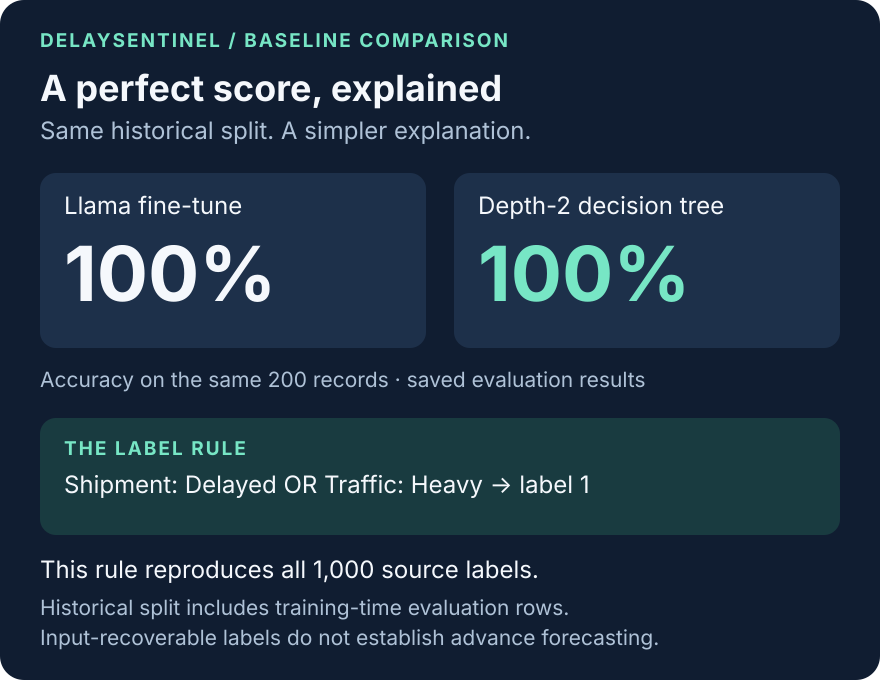
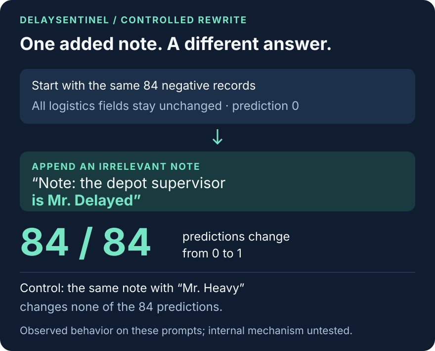
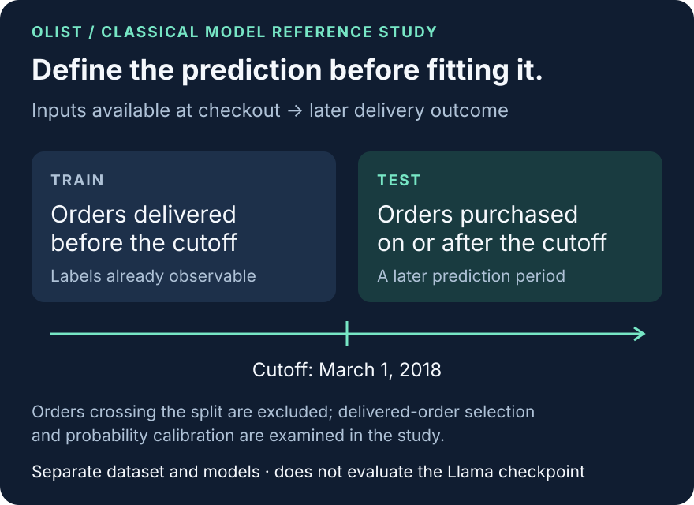

# DelaySentinel: from a published model to an inspectable evaluation

**Build the pipeline. Explain the score. Test the response.**

DelaySentinel brings together a published Llama fine-tune, a label-leakage audit, baseline comparisons and controlled tests of model behavior on logistics records. Its central result is a contrast: a perfect score on the original prompts coexists with responses that change when irrelevant text is added.

This case study follows that evidence from model development to the design of a separate real-order analysis. [中文](case_study.zh.md) · [Full evaluation](evaluation.md) · [Reproduction guide](reproduce.md)

## Build: turn logistics records into a working model pipeline

The original September 2025 project converted a Kaggle logistics table into chat records: fifteen `Column: value` input lines and a `Logistics_Delay: 0|1` response. An 800/200 split supported full-parameter supervised fine-tuning of Llama-3.2-1B-Instruct. The resulting checkpoint was published on Hugging Face, with training records and interface code now available in the repository.

That development work produced the artifact for the September 2026 evaluation: the actual published weights, the historical input files and the saved training logs. The evaluation added shared inference code, classical baselines, a reusable label scanner and behavioral probes. Each finding can be followed into saved results rather than inferred from a model description.

[Published checkpoint](https://huggingface.co/Yuchiwang02/Llama-3.2-1B-DelaySentinel) · [Training record](../runs/RUNS.md) · [Dataset and split](../data/SPLIT.md)

## Explain the score: put a simple baseline beside the model



Greedy evaluation of the checkpoint produced 200 correct labels from 200 historical test records. A depth-2 decision tree reached exactly the same score. Logistic regression and gradient boosting also matched it.

The label audit explains why this comparison matters. Across the full 1,000-row source table:

```text
Logistics_Delay = 1 iff
Shipment_Status == "Delayed" OR Traffic_Status == "Heavy"
```

The rule has zero exceptions. Both columns appear in every original input prompt. The model is therefore being scored against a label already recoverable from its inputs.

Removing both rule columns brings the tested boosting baseline to 0.500 accuracy and 0.452 AUROC. Further ablations and repeated cross-validation are recorded in the [evaluation report](evaluation.md). The feature-removal tests leave the boosting baselines near chance on this dataset.

The project turns this finding into a reusable [leakage scanner](leakage_audit.md). It searches for single-column conditions that are pure in the target, combines pure-positive conditions into a compact OR-rule and compares a shallow tree. A high score then has an explicit baseline to explain it.

**Evaluation scope.** The 200-row split is historical and unblinded: its first 20 rows were used for training-time evaluation loss. The frozen files support repeatable evaluation of this artifact within that historical scope.

## Test the response: change the input in controlled ways

A correct label alone does not show whether the model responds appropriately to a changed record. The probe suite rewrites the historical prompts and saves the output and answer-token margin.

The field-edit tests establish a useful starting point. Across 261 targeted edits, changing a relevant rule field flips every answer in the expected direction. Across 3,200 non-rule rewrite attempts, no answer changes; 197 of those attempts are no-ops because the original text already contains the replacement value.

The next tests vary wording and context.



Append **“Note: the depot supervisor is Mr. Delayed”** to the 84 negative prompts, keeping all logistics fields unchanged. Every prediction flips from 0 to 1. Replace the name with **“Mr. Heavy”** in the corresponding test, and none flips.

That controlled contrast is a concrete finding: irrelevant text can change the checkpoint's answer under these tested conditions.

Negation and synonyms add another contrast. Replacing `Delayed` with `Not Delayed` leaves all 73 affected predictions at 1. However, 23 of those records still satisfy the other `Heavy` condition. The remaining 50 are the cases that isolate the failure to respond to the negation. Replacing the same value with `Postponed` produces 50 zeros and 23 ones; the remaining ones again have `Heavy` traffic.

**These tests describe behavior, not an internal algorithm.** The outputs do not justify saying that the model scans an entire turn for a particular string or implements the dataset rule. The 104 probe sets reuse the same historical prompts, so their results are related. The [full probe tables](evaluation.md) preserve the selection conditions, controls and denominators needed to interpret them.

## Define the business prediction: a separate Olist study



The Olist study carries the evaluation questions into real, anonymized e-commerce orders. It uses **classical models on a different dataset**, with late delivery defined by comparing actual and estimated delivery dates.

The design starts from information timing. Features are restricted to checkout-time information. Training orders were delivered before March 1, 2018; test orders were purchased on or after that date. Orders crossing the boundary are excluded.

Logistic regression reaches **0.6908 AUROC** and **0.155 AUPRC**, against a test positive rate of **0.0722**. The companion analysis examines how the estimate changes when undelivered orders are included, how probability calibration shifts and how performance varies across observed months.

The month-block bootstrap captures variation among those observed periods. It does not guarantee performance in an unseen future period. The study also reports the limitations of selecting delivered orders. These checks make the next validation questions specific. [Design, results and sensitivity analysis](olist_reference.md)

## Document the project so the evidence stays usable

The current presentation separates the portfolio overview, the model card and the full evaluation report. Supporting artifacts include:

- the published checkpoint and historical training records;
- hashed split files and per-row predictions;
- a reusable scanner, baseline comparisons and behavioral probes;
- the separate Olist analysis and its sensitivity results;
- documentation checks, attribution and a reproducible inference format.

The release history also matters. Documentation, attribution and inference defaults were corrected after the original release. The checkpoint was not retrained as part of that work: the historical validation usage and training-mask behavior remain part of its record. [Training details](evaluation.md) · [Changelog](../CHANGELOG.md)

The training script is an attributed adaptation of third-party code with three documented local changes. This portfolio uses AI assistance for coding, analysis and documentation, with methods and recorded outputs available for inspection. [Attribution](../THIRD_PARTY_LICENSES.md)

## The workflow this project demonstrates

The sequence is transferable: define the outcome and when inputs are available, inspect labels, compare simple baselines, then test how the model responds when inputs change. Preserve the records needed for another reader to inspect the conclusion.

For DelaySentinel, that workflow explains a strong score and exposes specific behavioral sensitivities. For the Olist study, it clarifies the prediction setting and remaining validation work. The checkpoint is presented as a reproducible evaluation case, with evidence that readers can examine and extend.

The same interest continues in [BizHallu](https://github.com/Yuchi-Wang02/bizhallu): checking whether claims in generated retail analysis are supported by transaction evidence.

**Built with Llama.** [Model and license information](https://huggingface.co/Yuchiwang02/Llama-3.2-1B-DelaySentinel) · [Start reproducing](reproduce.md)
